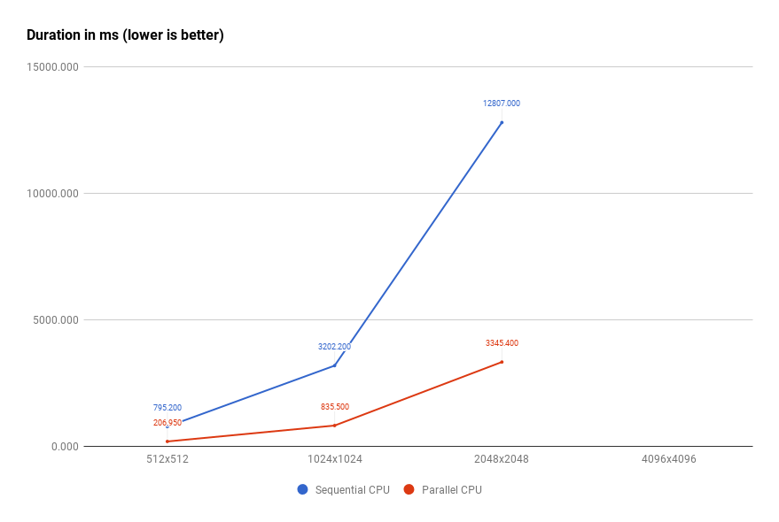
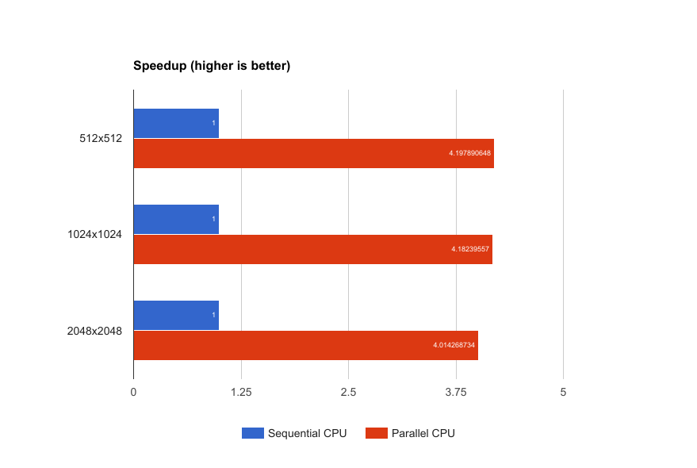

# Chapter 0
> Preparation for the real things.

## Overview
We are going to define a problem, which we will later solve with CUDA. Also reference CPU implementation must be done here, to ensure correctness and benchmarking of the GPGPU implementation.

## The problem
GPGPU applies pretty well to highly parallelizable tasks. We are going to implement one of image processing algorithms.
Because, usually as many threads available, as better the image processing performance can be achieved, since in many cases every pixel could be processed separately from others.

The chosen one is a **Bilateral filtering**, which is a noise reduction algorithm. We won't try to apply algorithm optimisations because we are focusing on CUDA programming with Rust here ;)

## The algorithm
Let's stick to the naive algorithm from [Wikipedia]. We are interested in final formula interpretation with Gaussian function as kernel, which is pretty straightforward :)

[Wikipedia]: https://en.wikipedia.org/wiki/Bilateral_filter

## Results
We made a playground for our later experiments with CUDA. Currently, our reference implementation of the algorithm has been implemented in a sequential and parallel way (almost without differences).

Results are quite predictable: four physical core **Intel i5-4690K** gives us robust **4x** speedup in parallel implementation with 4 threads, compared to sequential one. So, I'm looking forward to seeing how faster the CUDA implementation will be :)

