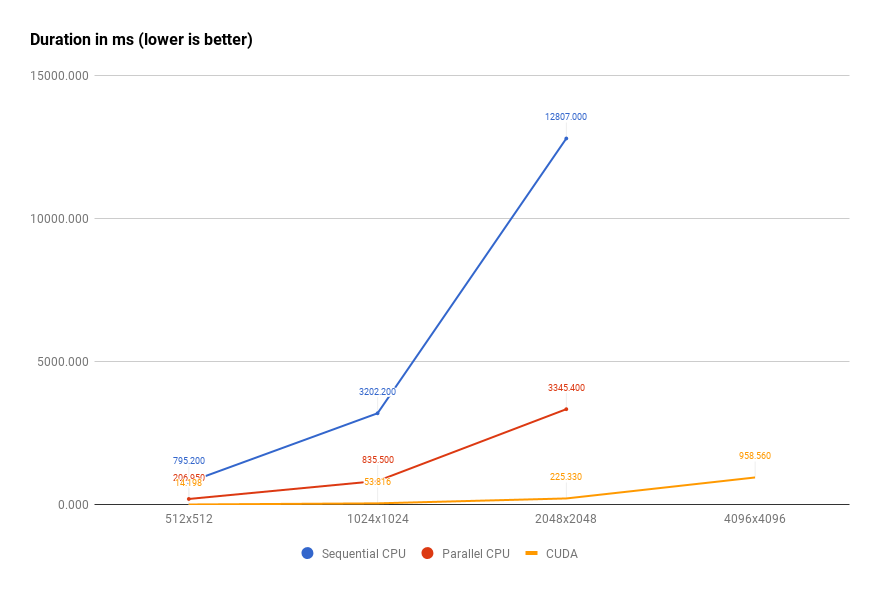

# Chapter 1
> First iteration. Separated CPU and GPU crates.

## Introduction
So, we have a reference algorithm implementation and reference filter outputs. We are now ready to dig into CUDA development.

For now, let's try the easiest approach: we are going to have independent crates with **host** and **device** code.

## Device code crate

### Prerequirements
First of all, we will need `xargo` and `ptx-linker`. Both can be installed from crates.io:
* `cargo install xargo`
* `cargo install ptx-linker`

We need `xargo` to build (because rust doesn't come with a prebuilt one) `libcore` for NVPTX target called `nvptx64-nvidia-cuda`.
Also, `ptx-linker` helps us with linking of multiple crates and can also help to avoid failed [LLVM i128 assertions - rust#38824](https://github.com/rust-lang/rust/issues/38824).

### How to compile the PTX assembly
There are an **easy**, **advanced** and **original** ways to develop CUDA crates.

* The **easy** way is to use [ptx-builder](https://crates.io/crates/ptx-builder) helper to automatically run `xargo` and eventually a `ptx-linker`.
* The **advanced** way involves manual compilation described in [ptx-linker](https://crates.io/crates/ptx-linker) README.
* The **original** way is using only `xargo` with `--emit asm` rustc flag and can be found at [japaric/nvptx](https://github.com/japaric/nvptx).

This chapter evolved from **original** to **advanced**, and finally to **easy** approach.
During preparation of this chapter, the `ptx-linker` and `ptx-builder` were created.
Each milestone gave significant convenience improvement and whole workflow advantages.

Needless to say, we are going to use an **easy** from now on :)

There should be couple preparation steps to be made:

1. First, we need to create "host" and "device" crates.
2. Our device crate should has a `nvptx-builtins = "0.1.0"` as dependency.
<br />We need it to access CUDA buildtins intrinsics.
3. Also, we need to follow instructions from [ptx-builder](https://crates.io/crates/ptx-builder) helper for the host crate:
<br />create a `build.rs` script and add the helper as `build-dependency`.
4. *Optional:* Trigger an error when we accidentaly compile device crate with host toolchain.
<br />Add to device crate code:
``` rust
#[cfg(not(target_os = "cuda"))]
compile_error!("This is a CUDA crate. Building it with host toolchain is not possible.");
```

After these steps, we are ready to start CUDA development!

### Kernels and device functions
We need to decide which functions should be kernels, and which are just device functions.
It's important to assign kernels a special ABI with `extern "ptx-kernel"` and prevent Rust from mangling their names.

Next example shows a significant difference between the two types of functions and mangling:
``` rust
// Kernel function:
#[no_mangle]
pub unsafe extern "ptx-kernel" fn bilateral_filter(/*...*/) { }

// Kernel function:
pub unsafe extern "ptx-kernel" fn bilateral_filter2(/*...*/) { }

// Normal function:
unsafe fn w_kernel(/*...*/) -> f64 { }
```

It will be compiled into something like:

```
.visible .entry
bilateral_filter(/*...*/)

.visible .entry
_ZN16chapter_1_kernel17bilateral_filter28whateverE(/*...*/)

.func (.param .b64 retval0)
_ZN16chapter_1_kernel8w_kernel17hab5b2aabbc8bc703E(/*...*/)
```

Both first and second functions are kernels and can be scheduled for execution on a GPU device, thanks to `.visible .entry`.
The third function can be called only from kernels or other device functions.

Hope you agree with me, that it's more convenient to call the first kernel with clear name than with second with mangled name ;)

### CUDA intrinsics
Normally we can't avoid using block and thread indices in kernels, at least because it's the essential part of parallelization.

In C/C++ code they can be accessed via `blockIdx.{x, y, z}`, `blockDim.{x, y, z}` and `threadIdx.{x, y, z}`.
In Rust we must use [LLVM intrinsics](https://llvm.org/docs/NVPTXUsage.html#llvm-nvvm-read-ptx-sreg) which can be accessed with:

``` rust
#![feature(platform_intrinsics)]

extern "platform-intrinsic" {
    pub fn nvptx_block_idx_x() -> i32;
    pub fn nvptx_block_dim_x() -> i32;
    pub fn nvptx_thread_idx_x() -> i32;
    // ...
}
```

But we don't really need to define them in each device crate, we will use already defined in [japaric/nvptx-builtins](https://github.com/japaric/nvptx-builtins/blob/master/src/lib.rs).

### Absence of `std`
We have to write `#![no_std]` code because, pretty obviously, original `std` crate cannot be easily compiled for CUDA (and in most cases, we won't even need it).
This means you also won't have access to any math from `std`.
You can workaround math issue in couple ways.

#### LLVM intrinsics
First, you can use [LLVM and Rust intrinsics](https://github.com/rust-lang/rust/blob/afa1240e57330d85a372db4e28cd8bc8fa528ccb/src/libcore/intrinsics.rs#L1040):

``` rust
extern "rust-intrinsic" {
    fn sqrtf64(x: f64) -> f64;
}

#[no_mangle]
pub unsafe extern "ptx-kernel" fn foo(src: *const f64, dst: *mut f64) {
    *dst.offset(0) = sqrtf64(*src.offset(0))
}
```

Here, the `sqrtf64` call will be translated to a `sqrt.rn.f64` PTX instruction.

The approach looks quite okay, but it's not really so nice as it might look like.
NVPTX target doesn't support all the intrinsics that LLVM declares.
For example, the next code can't be compiled:

``` rust
extern "rust-intrinsic" {
    fn expf64(x: f64) -> f64;
}

#[no_mangle]
pub unsafe extern "ptx-kernel" fn foo(src: *const f64, dst: *mut f64) {
    *dst.offset(0) = expf64(*src.offset(0))
}
```

because of error:

```
LLVM ERROR: Cannot select: t13: i64 = ExternalSymbol'exp'
In function: foo
```

because there is no exponent PTX instruction.
[Here is a list](http://docs.nvidia.com/cuda/parallel-thread-execution/#floating-point-instructions) of available PTX math functions available as instructions.

#### Math functions written in Rust
Alternatively, you can use any math library written in Rust and which doesn't have dependencies on `std`.

We will use the approach in this tutorial. The chosen math library is [nagisa/math.rs](https://github.com/nagisa/math.rs).

## Host code crate
At this point, we should already have a PTX assembly, we now need to decide about CUDA host bindings.
For this chapter, we will use a [japaric/cuda](https://github.com/japaric/cuda) because it has all basic stuff we need.

### How to load the PTX assembly
With **japaric/cuda** we need to perform next steps:

1. Call `driver::initialize()`.
2. Create `driver::Device` instance.
3. Create `driver::Context` instance.
4. Create `driver::Module` instance with PTX assembly.
5. Create `driver::Function` instance with the kernel name (your `pub extern "ptx-kernel"` function from device code crate).

We are going to provide the assembly for `driver::Module` with a help of macro: `include_str!("path/to/assembly.ptx")`.
That will store PTX at compile-time and we should not care about shipping the assembly with executable.
The path to assembly will be provided by environment variable `KERNEL_PTX_PATH` from our `build.rs`.

For easier understanding of the example, we will keep CUDA stuff as statics.
It's not a production-grade approach, but enough for our small demonstration application.

``` rust
use cuda::driver::{Context, Module, Function};

pub struct StaticContext(Context);
pub struct StaticModule(Module<'static>);

lazy_static! {
    pub static ref CUDA_CTX: StaticContext = StaticContext::new();
    pub static ref CUDA_MODULE: StaticModule = StaticModule::new(&CUDA_CTX);
}
```

More details can be found at [`host/src/static_cuda.rs`](host/src/static_cuda.rs).

### Executing the kernel
To run the CUDA version of a filter from [Chapter 0](../chapter-0/README.md) we need:

1. Allocate GPU memory for the input and output images.
2. Copy input image into the respective GPU memory.
3. Decide about *grid* and *block* sizes.
4. Launch the kernel.
5. Copy output image from GPU memory into RAM.
6. Free GPU memory.

The code located at [`host/src/filter/bilateral_cuda.rs`](host/src/filter/bilateral_cuda.rs).

Here is some notes:

* Since our test images have power-of-two dimensions, it's safe to just choose block size `(8, 8)` and then calculate grid as `(WIDTH / 8, HEIGHT / 8)`.
* **Don't forget!** CUDA contexts are thread-dependent. We have to call `cuCtxSetCurrent` (or `Context::set_current(&self)` in our case) if the current thread doesn't own the context.

## Results
Performance-wise the results are impressive. CUDA implementation gives about **60x** speedup over sequential algorithm on **GTX 1080** GPU.

Benchmarking with `criterion.rs` gives us next performance measurements:

```
cuda-512                time:   [14.014ms 14.198ms 14.432ms]
cuda-1024               time:   [53.664ms 53.816ms 54.001ms]
cuda-2048               time:   [224.23ms 225.33ms 226.21ms]
cuda-4096               time:   [929.81ms 958.56ms 984.98ms]
```



| Image resolution | CUDA speedup |
| ---------------- | ------------ |
| 512x512          | 56.008       |
| 1024x1024        | 59.503       |
| 2048x2048        | 56.837       |

## Next steps
In next chapters, we are going to merge both crates - device and host codebases.
Current implementation might be good enough unless we have some code to share between them.

We might change kernel arguments only in one of the crates.
Or, in our tutorial, we might change `Pixel` struct (add alpha channel, for example) and forget to reflect changes on the other crate.

So, let's go on and try to solve this inconvenience :)
